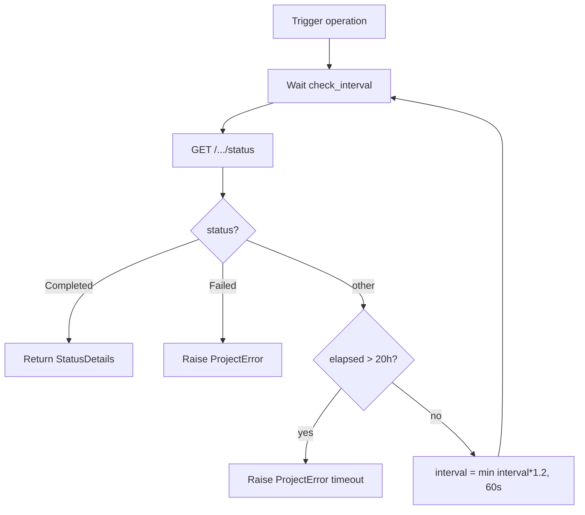
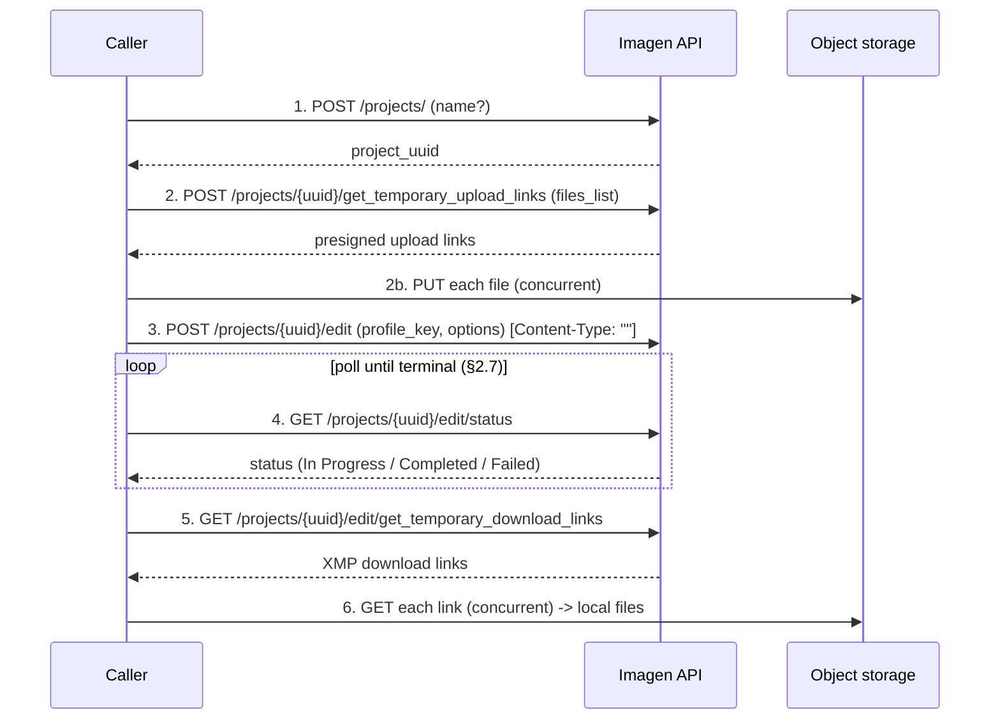
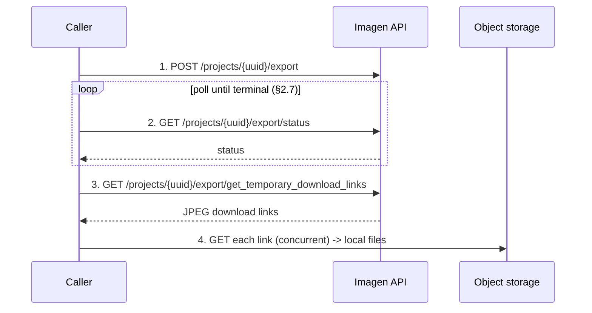
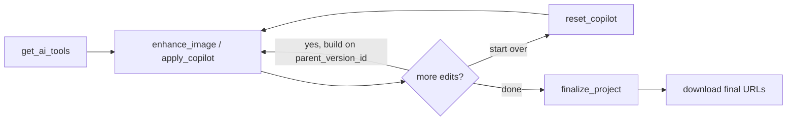
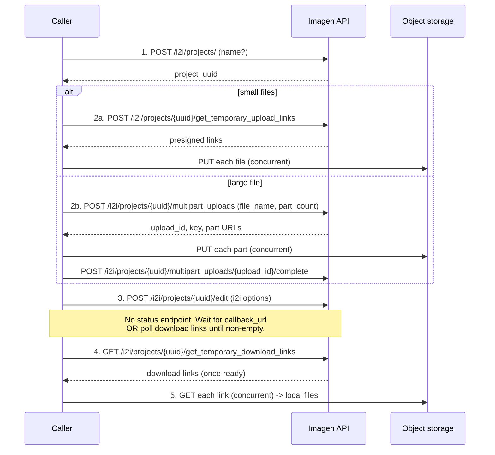

# Imagen AI SDK — Workflows

> **Purpose of this document.** This is a language-neutral description of every
> workflow the SDK orchestrates, written so it can serve as the *behavioral
> contract* for any SDK implementation (Python today; Node/Go/C#/etc. later).
> It captures not just *which* endpoints exist, but *how they are sequenced*,
> *how completion is detected*, *what concurrency and retry behavior is
> expected*, and *which rules every implementation must honor*. Reproduce this
> behavior and an SDK in any language will behave identically.
>
> Where this document and the code disagree, the code is the current truth and
> this document should be corrected.

---

## Table of contents

1. [Concepts and terminology](#1-concepts-and-terminology)
2. [Shared foundations (used by every workflow)](#2-shared-foundations-used-by-every-workflow)
3. [Project families ("project types")](#3-project-families-project-types)
4. [Workflow A — Standard editing (Regular projects)](#4-workflow-a--standard-editing-regular-projects)
5. [Workflow B — Export to JPEG (Regular projects)](#5-workflow-b--export-to-jpeg-regular-projects)
6. [Workflow C — AI Enhancement / Copilot / Finalize](#6-workflow-c--ai-enhancement--copilot--finalize)
7. [Workflow D — Image-to-Image (I2I) projects](#7-workflow-d--image-to-image-i2i-projects)
8. [Workflow E — Project management & discovery](#8-workflow-e--project-management--discovery)
9. [Photography types and recommended edit options](#9-photography-types-and-recommended-edit-options)
10. [Endpoint reference](#10-endpoint-reference)
11. [Cross-language portability checklist](#11-cross-language-portability-checklist)

---

## 1. Concepts and terminology

| Term | Meaning |
|------|---------|
| **Project** | Server-side container for a batch of images and their edits, addressed by a `project_uuid`. |
| **Project family** | The endpoint namespace a project lives under. Two exist: **Regular** (`/projects/...`) and **Image-to-Image / I2I** (`/i2i/projects/...`). This is the true "project type" split — they have different endpoints and different completion semantics. |
| **Profile** | A trained AI editing style, identified by an integer `profile_key`. Each profile is bound to one **image type** (`RAW` or `JPG`). |
| **Photography type** | An optional hint passed to editing (`WEDDING`, `REAL_ESTATE`, …). It does **not** change the workflow — only which edit options make sense. |
| **Edit** | AI editing pass that produces **XMP** sidecar files (Lightroom-compatible edit instructions). The original images are never modified. |
| **Export** | Optional pass that renders the edited images to final **JPEG** files for delivery. |
| **Enhancement / Copilot** | Per-image, post-edit AI operations (quick tools and natural-language instructions), versioned per image. |
| **Finalize** | Generates final download URLs for a project, upscaling any enhanced images. |
| **Presigned URL** | A temporary, direct-to-storage (S3) URL. Uploads `PUT` to it; downloads `GET` from it. The Imagen API itself never proxies file bytes. |

A key architectural fact reflected throughout: **the Imagen API only ever hands
out presigned URLs and project state. All file bytes move directly between the
client and object storage.** Every upload and download workflow is therefore a
two-phase pattern: (1) ask the API for links, (2) transfer bytes to/from storage.

---

## 2. Shared foundations (used by every workflow)

These behaviors are identical across all workflows and should be implemented
once per language, then reused.

### 2.1 Client, session, authentication

- **Base URL (production):** `https://api.imagen-ai.com/v1`
- **Auth header:** `x-api-key: <API_KEY>` on every API request.
- **User-Agent:** `Imagen-Python-SDK/<version>` (adjust per language, e.g. `Imagen-Go-SDK/...`).
- **HTTP timeout:** `300s` for API and storage transfers.
- A single reusable HTTP session/connection pool is created lazily and closed
  explicitly (the Python SDK uses an async context manager; other languages
  should provide the idiomatic equivalent — `defer client.Close()`, `using`, etc.).
- The API key must be validated as non-empty at construction time.

### 2.2 Request/response envelope handling

Responses come in **two shapes** and implementations must tolerate both:

- **Production:** payload at the root, e.g. `{"project_uuid": "..."}`.
- **Legacy/beta:** the same payload wrapped in a sole `data` key, e.g. `{"data": {"project_uuid": "..."}}`.

**Unwrap rule:** if the response is an object whose *only* key is `data`, use
`response["data"]`; otherwise use the response as-is. Apply this unwrap before
validating any response model.

### 2.3 HTTP error mapping

| Condition | Behavior |
|-----------|----------|
| `401` | Raise **AuthenticationError** ("Invalid API key or unauthorized"). |
| `>= 400` (other) | Extract the message from the JSON body, preferring `error.message` (the production shape `{"error": {"message": ...}}`), falling back to `detail`, then to raw text; raise **ImagenError** as `API Error (<status>): <message>`. |
| `204 No Content` | Treat as success with an empty body. |
| Network/transport failure | Raise **ImagenError** ("Request failed: …"). |

### 2.4 Error hierarchy

```
ImagenError (base)
├── AuthenticationError   — 401 / bad key
├── ProjectError          — project create / edit / export / status / parse failures
├── UploadError           — no valid files, missing link, storage PUT failure
└── DownloadError         — no links provided, all downloads failed
```

Validation failures when parsing a response into a model are raised as the
context-appropriate type (e.g. parsing the create-project response failure →
`ProjectError`).

### 2.5 Concurrent upload (shared by Regular and I2I standard uploads)

Inputs: a list of local paths, a `max_concurrent` limit (default **5**, must be
≥ 1), an optional `calculate_md5` flag, and an optional progress callback.

Algorithm:

1. **Validate paths.** Keep files that exist and are regular files; **skip**
   (with a warning) anything else. If *nothing* valid remains, raise `UploadError`.
2. **Build upload-info list.** For each valid file: `{ file_name, md5? }`.
   Compute MD5 (base64-encoded) only when `calculate_md5` is true.
3. **Request presigned upload links** from the family's upload-links endpoint.
   Build a `file_name → upload_link` map from the response.
4. **Upload concurrently** under a semaphore of size `max_concurrent`:
   - Look up the file's upload link (missing link → that file fails).
   - `PUT` the file bytes to the presigned URL; `raise_for_status()`.
   - Per-file failures are **captured, not fatal** — record `{file, success, error}`.
   - Fire the progress callback before and after each file.
5. **Return an `UploadSummary`**: `{ total, successful, failed, results[] }`.

> Partial success is by design: some files can fail while others succeed. Callers
> decide what to do based on `successful`/`failed`.

### 2.6 Concurrent download (shared by all workflows)

Inputs: a list of download URLs, an output directory, `max_concurrent` (default
**5**, ≥ 1), optional progress callback.

Algorithm:

1. Create the output directory (recursively) if missing.
2. If the link list is empty, raise `DownloadError`.
3. Download concurrently under a semaphore:
   - Derive the filename from the URL path (URL-decoded). If it has no usable
     name+extension, fall back to `imagen_edited_{index:05d}.jpg`.
   - `GET` the URL, `raise_for_status()`, stream/write bytes to disk.
   - Per-file failures are captured, not fatal.
4. If **every** download failed, raise `DownloadError`; otherwise return the list
   of successfully written local paths.

### 2.7 Status polling (Regular edit & export only)

Used by `start_editing` and `export_project`. **I2I has no status endpoint** (see
Workflow D).

- **Endpoint:** `GET /projects/{uuid}/{operation}/status` where `operation ∈ {edit, export}`.
- **Initial interval:** `10s`.
- **Backoff:** multiply interval by `1.2` after each poll, **capped at 60s**.
- **Max wait:** `72000s` (20 hours); exceeding it raises `ProjectError` (timeout).
- **Terminal states:**
  - `"Completed"` → return the final `StatusDetails`.
  - `"Failed"` → raise `ProjectError`, appending `details` if present.
  - any other status → keep polling.
- `StatusDetails` shape: `{ status: str, progress?: float, details?: str }`.



### 2.8 File type rules

- A project is **homogeneous**: all files in one project must be the same type —
  **all RAW** or **all JPEG**. They must also match the chosen profile's `image_type`.
- **RAW extensions:** `.dng .nef .cr2 .arw .nrw .crw .srf .sr2 .orf .raw .rw2 .raf .ptx .pef .rwl .srw .cr3 .3fr .fff`
- **JPEG extensions:** `.jpg .jpeg`
- A pre-upload validation helper (`check_files_match_profile_type`) compares the
  file set against the profile's type and raises `UploadError` on any mismatch,
  mixed types, or unsupported extension. Implementations should provide an
  equivalent guard.

---

## 3. Project families ("project types")

Two project families exist. Everything else (photography type, edit options,
enhancement) is a *parameter* or *sub-operation* within a family.

| Aspect | **Regular** (`/projects`) | **Image-to-Image / I2I** (`/i2i/projects`) |
|--------|---------------------------|--------------------------------------------|
| Primary output | XMP edits (+ optional JPEG export) | Edited images downloaded directly |
| Profile required | **Yes** (`profile_key`) | **No** |
| Status endpoint | **Yes** (`/edit/status`, `/export/status`) | **No** — completion via callback or download-link polling |
| Large-file upload | Standard concurrent PUT | Standard **or** S3 **multipart** upload |
| Edit options model | `EditOptions` (rich) | `I2IEditOptions` (subset) |
| Export step | Yes (`/export`) | No (no separate export pass) |
| Enhancement/Copilot/Finalize | Yes (`project_source=REGULAR`) | Yes (`project_source=I2I`) |

The shared foundations in §2 apply to both families. The sections below describe
each family's end-to-end flow.

---

## 4. Workflow A — Standard editing (Regular projects)

The core flow and the one most users run. Produces XMP edit files.



### Steps

| # | Operation | Endpoint | Notes |
|---|-----------|----------|-------|
| 1 | **Create project** | `POST /projects/` | Body `{name?}`. Name must be unique per account; omit to get a server-generated UUID. Returns `project_uuid`. |
| 2 | **Upload images** | `POST /projects/{uuid}/get_temporary_upload_links` then PUT to storage | Uses the shared concurrent upload (§2.5). Body `{ files_list: [{file_name, md5?}] }`. |
| 3 | **Start editing** | `POST /projects/{uuid}/edit` | Body `{ profile_key, photography_type?, ...edit_options }`. **Quirk:** send an explicitly empty `Content-Type: ""` header (the API rejects the default JSON content type here). |
| 4 | **Poll status** | `GET /projects/{uuid}/edit/status` | Shared polling (§2.7). Blocks until `Completed`/`Failed`. |
| 5 | **Get download links** | `GET /projects/{uuid}/edit/get_temporary_download_links` | Returns list of XMP download URLs. |
| 6 | **Download files** | (storage GET) | Shared concurrent download (§2.6). |

### Notes & invariants

- `start_editing` **blocks** (it includes step 4's polling). A non-blocking
  variant can be offered, but the default contract is "returns when editing is done."
- `profile_key` is required and must match the file type (validate with §2.8).
- Editing produces XMP only; the originals are untouched.

### One-call convenience: `quick_edit`

A high-level wrapper that runs the whole flow. Order of operations:

1. Fetch the profile by key and validate file types against it (§2.8).
2. Create project → upload images.
3. **Abort if `upload_summary.successful == 0`** (raise `UploadError`).
4. `start_editing` (with optional `photography_type` + `edit_options`).
5. Get XMP download links.
6. If `export=True`: run Workflow B, capturing export links (re-raise on failure).
7. If `download=True`: download XMP files; if export links exist, download those
   too (default export subdir is `<download_dir>/exported`).
8. Return `QuickEditResult { project_uuid, upload_summary, download_links,
   export_links?, downloaded_files?, exported_files? }`.

---

## 5. Workflow B — Export to JPEG (Regular projects)

Optional pass after editing completes. Renders final client-ready JPEGs.



| # | Operation | Endpoint | Notes |
|---|-----------|----------|-------|
| 1 | **Start export** | `POST /projects/{uuid}/export` | No body required. |
| 2 | **Poll status** | `GET /projects/{uuid}/export/status` | Shared polling (§2.7), `operation = export`. |
| 3 | **Get export links** | `GET /projects/{uuid}/export/get_temporary_download_links` | Returns final JPEG download URLs. |
| 4 | **Download** | (storage GET) | Shared concurrent download (§2.6). |

**Per-image export links** are also available (used for advanced flows):
- `GET /projects/{uuid}/export/get_upload_link?file_name=` → presigned upload link for a single exported image.
- `GET /projects/{uuid}/export/get_download_link?file_name=` → download link for a single exported image.

**Precondition:** editing (Workflow A) must have completed for the project.

---

## 6. Workflow C — AI Enhancement / Copilot / Finalize

Per-image, post-edit AI operations. Works on **already-edited** images in either
project family (pass `project_source = REGULAR | I2I`). Endpoints live under the
`/projects/...` namespace regardless of family; the family is selected via the
`project_source` parameter/body field.

> **Preconditions (verified against the API gateway):**
> - **Export first.** For Regular projects every operation in this workflow
>   (`get_ai_tools`, `enhance_image`, `apply_copilot`, `finalize_project`) requires the
>   project's export to have completed; otherwise the gateway returns
>   `400 "Project has not been exported yet."` (I2I projects gate on the project being
>   `Completed` instead.)
> - **Realistic-only gating.** Whether a given tool/instruction is permitted is decided
>   by the downstream editing service, **not** the gateway. Restricted accounts reject
>   generative requests (and copilot instructions classified as generative) with
>   `400 "Only realistic editing requests are supported."` A reimplementation cannot
>   predict this locally; surface the API error. The `enabled_for_batch` flag on each
>   tool is passed through opaquely and does not, by itself, gate realistic vs. generative.



| Operation | Endpoint | Notes |
|-----------|----------|-------|
| **List AI tools** | `GET /projects/{uuid}/ai-tools?project_source=` | Returns `{ prompts: [{ enhancement_type, label?, enabled_for_batch? }] }`. Use a tool's `enhancement_type` as the `tool_id` below. Extra fields are preserved. |
| **Enhance image** | `POST /projects/{uuid}/images/{filename}/enhance` | Body `{ tool_id, parent_version_id?, project_source }`. Applies a quick tool to one image. |
| **Apply copilot** | `POST /projects/{uuid}/images/{filename}/copilot` | Body `{ instruction (1–255 chars), parent_version_id?, project_source }`. Natural-language edit. |
| **Reset copilot** | `DELETE /projects/{uuid}/images/{filename}/copilot` | Body `{ project_source }`. Clears the image's copilot conversation history. |
| **Finalize project** | `POST /projects/{uuid}/finalize` | Body `{ project_source }`. Generates final download URLs, upscaling enhanced images. |

### Versioning model

Enhancements and copilot instructions are **versioned per image**. Passing
`parent_version_id` builds a new version *on top of* a prior one, enabling an
iterative chain. Omitting it starts from the base edited image. `reset_copilot`
discards the conversation history so the next instruction starts fresh.

> **Response shapes (verified against the API gateway source, v1.1.0):**
> - `enhance_image` and `apply_copilot` both return the server's `AIEnhancementResponse`
>   → modeled as **`EnhanceResult`** `{ status: str, version_id: any (nullable),
>   enhanced_image_url: str }`.
> - `finalize_project` returns the same shape as the download-links endpoints →
>   **`DownloadLinksList`** `{ files_list: [{ file_name, download_link }] }`.
> - `start_i2i_editing` returns **`MessageResponse`** `{ message: str }`.
> - `get_i2i_download_link` (single image) returns **`SingleDownloadLink`**
>   `{ download_link: str }`.
>
> All models allow unknown extra fields for forward compatibility. `version_id` is
> intentionally untyped because the server declares it as an open, optional field.

---

## 7. Workflow D — Image-to-Image (I2I) projects

A separate project family with its own endpoints. The defining differences:
**no profile**, **no status endpoint**, and support for **S3 multipart upload**
of very large files.



### Project lifecycle

| Operation | Endpoint | Notes |
|-----------|----------|-------|
| Create | `POST /i2i/projects/` | Body `{name?}` → `project_uuid`. |
| List | `GET /i2i/projects` | Params `{size, page, is_archived?}`. |
| Validate name | `GET /i2i/projects/is_valid_name?name=` | Returns bool; a 2xx with no explicit flag is treated as valid. |
| Get one | `GET /i2i/projects/{uuid}?get_thumbnail=` | Returns a `ProjectListItem`. |

### Upload — standard

`POST /i2i/projects/{uuid}/get_temporary_upload_links` then concurrent PUT
(§2.5). Body uses `{ files_list, client_type }` (defaults `client_type = API`).

Single-file link: `GET /i2i/projects/{uuid}/get_upload_link?file_name=`.

### Upload — multipart (large files)

For one large file, split into parts and upload each to its own presigned URL.

- **Part size:** default **64 MB** (S3 requires ≥ 5 MB per part except the last).
- **Part count:** `ceil(file_size / part_size)`, minimum 1, range 1–10000.
- **Concurrency:** default **4** concurrent parts.
- **Memory bound:** read each chunk *inside* the semaphore so peak memory is
  bounded to `max_concurrent × part_size`.
- **Steps:**
  1. `POST /i2i/projects/{uuid}/multipart_uploads` with `{ file_name, part_count }`
     → `{ upload_id, key, parts: [{ part_number, upload_url }] }`.
  2. For each part: seek to `(part_number - 1) * part_size`, read `part_size`
     bytes, `PUT` to `upload_url`.
  3. `POST /i2i/projects/{uuid}/multipart_uploads/{upload_id}/complete` with `{ file_name }`.
- **Failure handling (mandatory):** on *any* part/complete failure, call
  `DELETE /i2i/projects/{uuid}/multipart_uploads/{upload_id}` with `{ key }` to
  abort the upload, then raise `UploadError`. Abort failures are logged but the
  original error is what propagates.

### Editing & completion

- **Trigger:** `POST /i2i/projects/{uuid}/edit` with optional `I2IEditOptions`
  (`hdr_merge`, `sky_replacement`, `sky_replacement_template_id`,
  `perspective_correction`, `callback_url`). Returns immediately with a
  `MessageResponse` `{ message }`.
- **Completion detection (critical difference):** there is **no status
  endpoint**. Two supported strategies:
  1. **Webhook:** provide `callback_url` in the edit options; the server calls it on completion.
  2. **Poll downloads:** call `get_i2i_download_links` periodically until it
     returns a non-empty list. (Polling cadence is the caller's choice; reuse the
     §2.7 backoff shape for consistency.)

### Download

- All images: `GET /i2i/projects/{uuid}/get_temporary_download_links` → URLs,
  then shared concurrent download (§2.6).
- Single image: `GET /i2i/projects/{uuid}/get_download_link?file_name=` →
  `SingleDownloadLink` `{ download_link }`.

---

## 8. Workflow E — Project management & discovery

Supporting read/discovery operations used across the other workflows. None of
these mutate edits; they exist to find IDs, profiles, and templates.

| Operation | Endpoint | Returns |
|-----------|----------|---------|
| **List profiles** | `GET /profiles` | `Profile[]` — `{ image_type, profile_key, profile_name, profile_type }`. Accepts a bare list (prod) or `{data:{profiles:[…]}}` (legacy). |
| **Get one profile** | (client-side filter of `GET /profiles`) | Single `Profile` by key; raises `UploadError` if not found. |
| **List projects** | `GET /projects` | `{ projects: ProjectListItem[], pagination: {total,size,page} }`. Params `{size,page,client_type,is_archived?,get_thumbnail}`. |
| **Get project** | `GET /projects/{uuid}?get_thumbnail=` | `ProjectListItem`. |
| **Resolve name → UUID** | `GET /projects/{name}/uuid` | UUID string (tolerates `str`, `{project_uuid}`, or `{uuid}` shapes). |
| **List sky templates** | `GET /projects/sky_replacement/templates` | `SkyTemplate[]` — `{ id, is_default }`; use `id` for `EditOptions.sky_replacement_template_id`. |

**Standalone convenience functions** mirror these for one-shot use without
managing a client instance: `get_profiles`, `get_profile`,
`get_sky_replacement_templates`, `list_projects`, `get_ai_tools`. Each spins up a
temporary client, runs the call, and tears it down.

### Pagination

List endpoints are zero-based: `page` starts at `0`, `size` is 1–100 (default
20). `pagination.total` is the full count; iterate pages until
`page * size >= total`.

---

## 9. Photography types and recommended edit options

Photography type is a single optional argument to `start_editing`
(`photography_type`); it does **not** branch the workflow. What changes per type
is which `EditOptions` are meaningful. The table below is the practical mapping
(derived from the SDK examples) — implementations don't enforce it, but SDK docs
and helpers should steer users toward it.

| Photography type | Typical edit options |
|------------------|----------------------|
| `PORTRAITS` | `portrait_crop`, `smooth_skin`, `subject_mask`, `straighten` |
| `WEDDING` | `portrait_crop`, `smooth_skin`, `subject_mask`, `straighten` |
| `FAMILY_NEWBORN` / `BOUDOIR` | `portrait_crop` or `headshot_crop`, `smooth_skin`, `subject_mask` |
| `SCHOOL` / headshots | `headshot_crop`, `smooth_skin`, `perspective_correction`, `subject_mask` |
| `REAL_ESTATE` | `crop`, `perspective_correction`, `window_pull`, `hdr_merge`, `crop_aspect_ratio`, optional `sky_replacement` (+ template id) |
| `LANDSCAPE_NATURE` | `crop`, `straighten`, `sky_replacement` (+ template id), `hdr_merge` |
| `EVENTS` / `SPORTS` | `crop`, `straighten`, `subject_mask` |
| `OTHER` / `NO_TYPE` | `crop`, `straighten` (general defaults) |

### `EditOptions` reference and rules

Full option set: `crop`, `straighten`, `hdr_merge`, `portrait_crop`,
`smooth_skin`, `subject_mask`, `headshot_crop`, `perspective_correction`,
`sky_replacement`, `sky_replacement_template_id`, `window_pull`,
`crop_aspect_ratio`, `callback_url`, `hdr_output_compression` (`LOSSY|LOSSLESS`).

**Mutual-exclusivity rules (must be enforced client-side, fail fast):**

- At most **one crop mode**: `crop`, `headshot_crop`, `portrait_crop`.
- At most **one straightening mode**: `straighten`, `perspective_correction`.

Violations raise a validation error before any request is sent. The payload is
serialized with null fields omitted (`exclude_none`), so only explicitly-set
options are transmitted.

`I2IEditOptions` is the I2I subset: `hdr_merge`, `sky_replacement`,
`sky_replacement_template_id`, `perspective_correction`, `callback_url`.

---

## 10. Endpoint reference

All paths are relative to `https://api.imagen-ai.com/v1`. Auth header
`x-api-key` on every call.

### Regular projects

| Method | Path | Purpose |
|--------|------|---------|
| POST | `/projects/` | Create project |
| GET | `/projects` | List projects (paginated) |
| GET | `/projects/{uuid}` | Get one project |
| GET | `/projects/{name}/uuid` | Resolve name → UUID |
| POST | `/projects/{uuid}/get_temporary_upload_links` | Get upload links |
| POST | `/projects/{uuid}/edit` | Start editing (`Content-Type: ""`) |
| GET | `/projects/{uuid}/edit/status` | Edit status (poll) |
| GET | `/projects/{uuid}/edit/get_temporary_download_links` | XMP download links |
| POST | `/projects/{uuid}/export` | Start export |
| GET | `/projects/{uuid}/export/status` | Export status (poll) |
| GET | `/projects/{uuid}/export/get_temporary_download_links` | JPEG export links |
| GET | `/projects/{uuid}/export/get_upload_link?file_name=` | Per-image export upload link |
| GET | `/projects/{uuid}/export/get_download_link?file_name=` | Per-image export download link |
| GET | `/projects/sky_replacement/templates` | Sky templates |
| GET | `/profiles` | List profiles |

### Enhancement / Copilot / Finalize (family via `project_source`)

| Method | Path | Purpose |
|--------|------|---------|
| GET | `/projects/{uuid}/ai-tools?project_source=` | List AI tools |
| POST | `/projects/{uuid}/images/{filename}/enhance` | Apply quick tool |
| POST | `/projects/{uuid}/images/{filename}/copilot` | Apply NL instruction |
| DELETE | `/projects/{uuid}/images/{filename}/copilot` | Reset copilot history |
| POST | `/projects/{uuid}/finalize` | Finalize (generate final URLs) |

### I2I projects

| Method | Path | Purpose |
|--------|------|---------|
| POST | `/i2i/projects/` | Create I2I project |
| GET | `/i2i/projects` | List I2I projects |
| GET | `/i2i/projects/is_valid_name?name=` | Validate name |
| GET | `/i2i/projects/{uuid}` | Get one I2I project |
| POST | `/i2i/projects/{uuid}/get_temporary_upload_links` | Get upload links |
| GET | `/i2i/projects/{uuid}/get_upload_link?file_name=` | Single upload link |
| POST | `/i2i/projects/{uuid}/multipart_uploads` | Create multipart upload |
| POST | `/i2i/projects/{uuid}/multipart_uploads/{upload_id}/complete` | Complete multipart |
| DELETE | `/i2i/projects/{uuid}/multipart_uploads/{upload_id}` | Abort multipart (body `{key}`) |
| POST | `/i2i/projects/{uuid}/edit` | Trigger I2I edit (no status) |
| GET | `/i2i/projects/{uuid}/get_temporary_download_links` | All download links |
| GET | `/i2i/projects/{uuid}/get_download_link?file_name=` | Single download link |

---

## 11. Cross-language portability checklist

When porting these workflows to another language, an implementation is
"correct" when it reproduces all of the following behaviors:

- [ ] `x-api-key` auth, 300s timeouts, reusable session, language-appropriate `User-Agent`.
- [ ] Envelope unwrap rule (sole `data` key) applied before every model parse (§2.2).
- [ ] HTTP error mapping incl. 401 → AuthenticationError and message extraction (`error.message` → `detail` → raw text) (§2.3).
- [ ] The four-type error hierarchy (§2.4).
- [ ] Concurrent upload with default concurrency 5, path validation/skip, partial-success summary (§2.5).
- [ ] Concurrent download with filename derivation + fallback, partial success, all-fail → error (§2.6).
- [ ] Polling: start 10s, ×1.2 backoff capped at 60s, 20h max, terminal `Completed`/`Failed` (§2.7).
- [ ] File-type homogeneity + profile-type match validation (§2.8).
- [ ] `start_editing` sends `Content-Type: ""` (§4 step 3).
- [ ] `quick_edit` aborts when zero uploads succeed (§4).
- [ ] I2I multipart: 64MB parts, ≤10000 parts, concurrency 4, memory bound, **abort-on-failure** (§7).
- [ ] I2I completion via callback or download-link polling (no status endpoint) (§7).
- [ ] `EditOptions` mutual-exclusivity enforced client-side, `null` fields omitted from payload (§9).
- [ ] Typed returns for enhancement/copilot (`EnhanceResult`), finalize (`DownloadLinksList`), I2I edit trigger (`MessageResponse`), and single I2I link (`SingleDownloadLink`); models tolerate unknown extra fields (§6).

> This checklist is the minimum bar for the **scenario/contract test suite**: each
> item should map to at least one test that every language SDK runs against a
> shared mock server.
